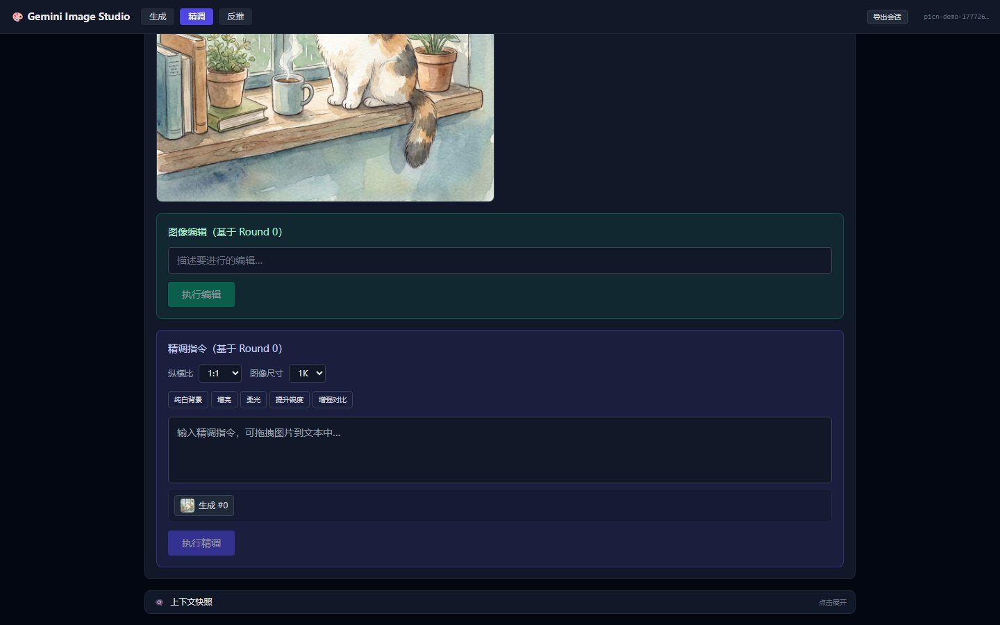

[简体中文](README_zh.md)

# gemini-imagen-patterns

A Claude skill + MCP Server for multimodal image generation with the `@google/genai` SDK.

Includes **Gemini Image Studio** — a visual Web UI for interactive generation, multi-turn refinement, and LAAJ evaluation.

## Two Usage Modes

### 1. CLI + SSE Mode (Human-in-the-loop)

MCP Server acts as a bridge between CLI agents and the web browser.

```
CLI (Kimi / Claude)          MCP Server               Browser (Web UI)
     │                            │                            │
     ├─ open_image_studio() ────►│─── SSE ───────────────────►│  Open tab
     │                            │                            │
     ├─ generate_image() ───────►│─── SSE ───────────────────►│  Show result
     │                            │                            │
     ├─ choose_best(A, B) ──────►│─── SSE choice-request ────►│  Popup A/B
     │◄───────────────────────────│◄── POST /api/choice ──────┤  User clicks
     │                            │                            │
     ├─ refine_image() ─────────►│─── SSE ───────────────────►│  Show refined
```

### 2. Pure Web Mode (Visual Simulator)

Open the studio directly in a browser without any CLI:

```bash
npm start
# open http://localhost:3456
```

## Quick Start

```bash
cd web-ui
cp .env.example .env   # add GEMINI_API_KEY
npm install
npm start              # http://localhost:3456
```

**MCP connection:**
```json
{
  "mcpServers": {
    "gemini-image-studio": {
      "url": "http://localhost:3456/mcp/sse"
    }
  }
}
```

Full tool list and scenario guides → [SKILL.md](SKILL.md)

## Usage Examples

### Example 1: Generate a Pokémon character (Text-to-Image)

Use data from the [PokéAPI](https://pokeapi.co/) to build a rich prompt:

```typescript
const pokemon = await fetch('https://pokeapi.co/api/v2/pokemon/pikachu').then(r => r.json());
const prompt = `A cute ${pokemon.types.map(t => t.type.name).join('/')}-type Pokemon named ${pokemon.name}, ${pokemon.height / 10}m tall, ${pokemon.weight / 10}kg, yellow fur, red cheeks, lightning bolt tail, full body portrait, clean white background, anime style, high detail`;
```

Paste into the **Generate** tab, pick aspect ratio `1:1` and size `2K`, then generate:


### Example 2: Reverse-engineer a Waifu image (Image-to-Prompt)

Grab a random anime image from [waifu.pics](https://waifu.pics/):

```bash
curl -s https://api.waifu.pics/sfw/waifu | jq -r '.url'
```

Upload to the **Reverse** tab and pick a mode:


### Example 3: Multi-turn Refine with LAAJ

After generating, switch to the **Refine** tab. Pick any round to **Judge** (LAAJ scores), **Edit** (pixel-level), or **Refine** (multi-turn with `thoughtSignature` and `[pic_N]` drag-and-drop):



## Web UI Features

| Tab | What you can do |
|-----|-----------------|
| **Generate** | Upload subject/style refs (optional), write prompt, pick ratio/size/thinking level, generate |
| **Refine** | Round timeline with thumbnails → select round → Judge / Edit / Refine with quick chips and `[pic_N]` drag-and-drop |
| **Reverse** | Upload image → reverse-engineer plain prompt or structured segments (identity, canvas, environment, view, material, style, quality) |

Key capabilities: Parts array construction · `[pic_N]` interleaving · `thoughtSignature` multi-turn refine · File API caching · LAAJ evaluation loop · Human-in-the-loop via SSE

## Project Structure

```
├── SKILL.md              # Main entry: 4 usage scenarios + SDK patterns
├── references/           # Detailed docs: examples, models, multiturn, LAAJ
└── web-ui/               # Gemini Image Studio (Express + MCP SSE + React)
```

## License

MIT
