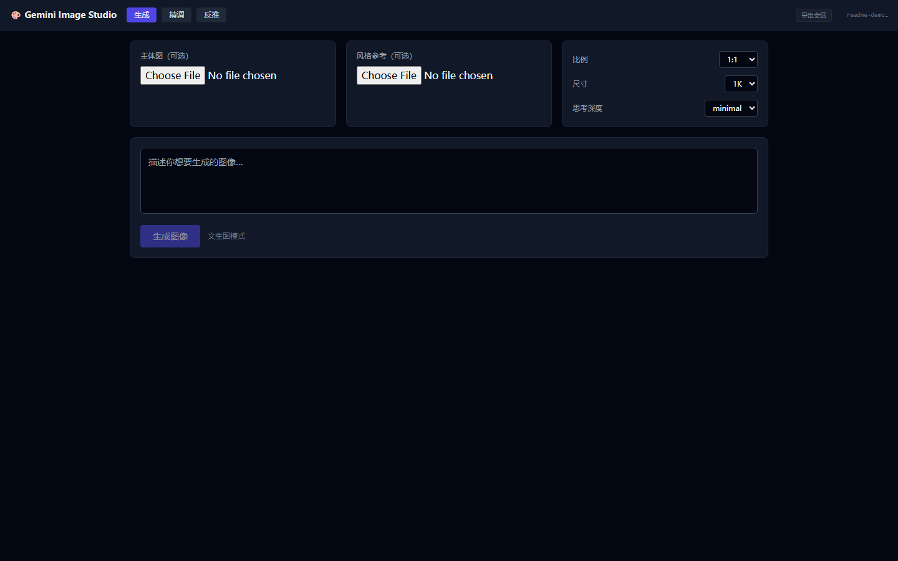
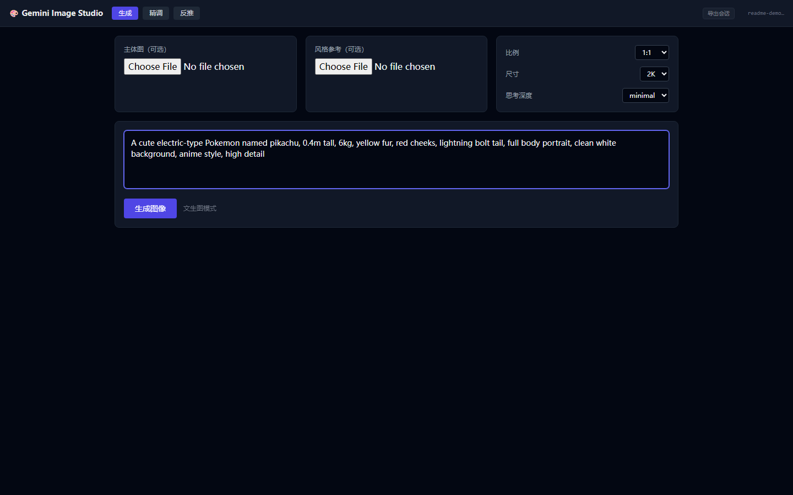
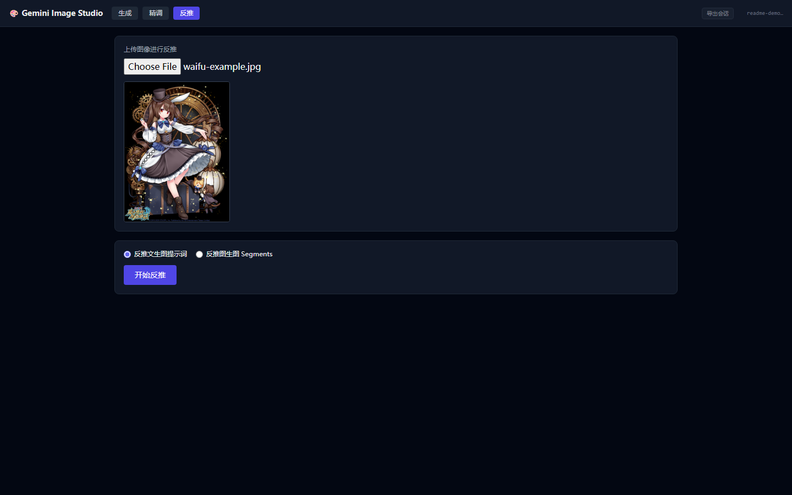
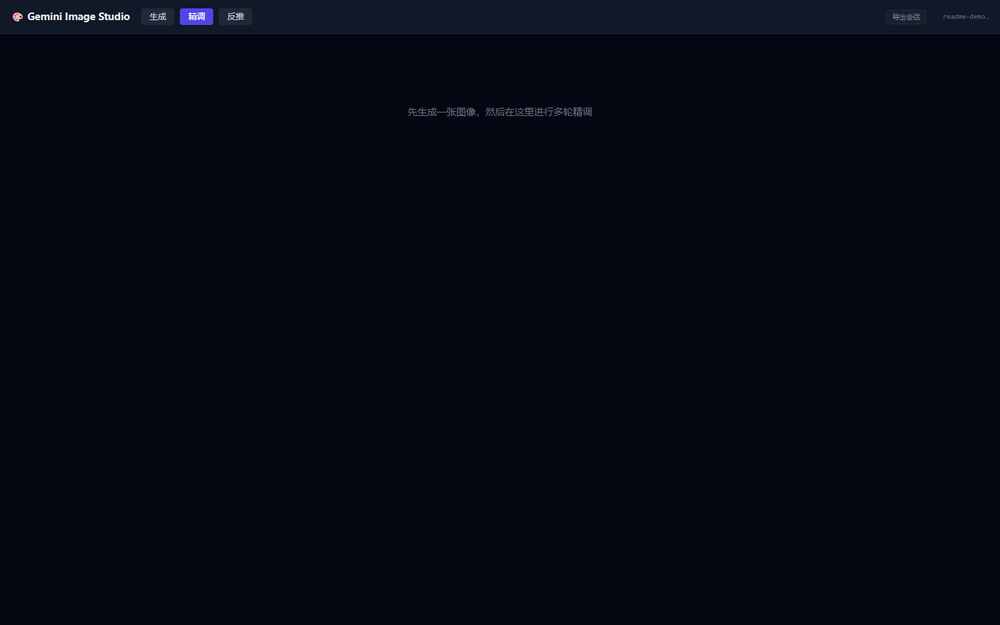

# gemini-imagen-patterns

A Claude skill + MCP Server for building multimodal image generation pipelines with the `@google/genai` SDK.

Now includes **Gemini Image Studio** — a visual web UI + MCP Server for interactive image generation and multi-turn refinement.

## What it covers

- **Parts array construction** — `text`, `inlineData`, `fileData` / `createPartFromUri`
- **Text-image-text interleaving** — `[pic_1]` / `[pic_N]` pattern
- **File API caching** — upload, 47h TTL, 403 fallback to inlineData
- **Multi-turn Refine** — 3-turn structure with `thoughtSignature` injection
- **Thinking config** — `ThinkingLevel` for Gemini 3, `thinkingBudget` for Gemini 2.5
- **LAAJ evaluation loop** — LLM-as-a-Judge with `gemini-2.5-flash`
- **Human-in-the-loop** — CLI triggers decisions, browser UI collects human input via SSE

## Two Usage Modes

### 1. CLI + SSE Mode (Human-in-the-loop)

MCP Server acts as a bridge between CLI agents and the web browser.

```
CLI (Kimi / Claude)          MCP Server               Browser (Web UI)
     │                            │                            │
     ├─ open_image_studio() ────►│─── SSE ───────────────────►│  Open tab
     │                            │                            │
     ├─ generate_image() ───────►│─── SSE ───────────────────►│  Show result
     │                            │                            │
     ├─ choose_best(A, B) ──────►│─── SSE choice-request ────►│  Popup A/B
     │◄───────────────────────────│◄── POST /api/choice ──────┤  User clicks
     │                            │                            │
     ├─ refine_image() ─────────►│─── SSE ───────────────────►│  Show refined
```

### 2. Pure Web Mode (Visual Simulator)

Open the studio directly in a browser without any CLI:

```bash
npm start
# open http://localhost:3456
```

Use it as a visual playground for Gemini image generation — upload images, write prompts, refine results, and evaluate with LAAJ, all in one page.

## Quick Start

### Prerequisites

- Node.js 18+
- A Gemini API key

### Install & Run

```bash
cd web-ui
# Copy and fill in your API key
cp .env.example .env
# Edit .env: GEMINI_API_KEY=your_key_here

# Install dependencies
npm install

# Start the server (serves both MCP SSE + Web UI)
npm start
```

The server starts on `http://localhost:3456`:
- Web UI: `http://localhost:3456`
- MCP SSE endpoint: `http://localhost:3456/mcp/sse`
- MCP message endpoint: `http://localhost:3456/mcp/message`

### Connect MCP Client

Configure your MCP client (Claude Desktop, Kimi CLI, etc.) to connect via SSE:

```json
{
  "mcpServers": {
    "gemini-image-studio": {
      "url": "http://localhost:3456/mcp/sse"
    }
  }
}
```

## Usage Examples

### Example 1: Generate a Pokémon character (Text-to-Image)

Use data from the [PokéAPI](https://pokeapi.co/) to build a rich, structured prompt:

```typescript
const pokemon = await fetch('https://pokeapi.co/api/v2/pokemon/pikachu').then(r => r.json());
const prompt = `A cute ${pokemon.types.map(t => t.type.name).join('/')}-type Pokemon named ${pokemon.name}, ${pokemon.height / 10}m tall, ${pokemon.weight / 10}kg, yellow fur, red cheeks, lightning bolt tail, full body portrait, clean white background, anime style, high detail`;
```

Paste the prompt into the **Generate** tab, pick aspect ratio `1:1` and size `2K`, then click **生成图像**:





### Example 2: Reverse-engineer a Waifu image (Image-to-Prompt)

Grab a random anime image from [waifu.pics](https://waifu.pics/):

```bash
curl -s https://api.waifu.pics/sfw/waifu | jq -r '.url'
```

Upload it to the **Reverse** tab and choose a mode:

- **反推文生图提示词** — Get a plain text-to-image prompt
- **反推图生图 Segments** — Get structured segments (identity, canvas, environment, view, material, style, quality)



### Example 3: Multi-turn Refine with LAAJ

After generating an image, switch to the **Refine** tab:



Once rounds exist, the timeline shows thumbnails of every generation. Pick any round to:

1. **Judge** — Run LAAJ evaluation (scores + improvement suggestions)
2. **Edit** — Pixel-level editing with a natural-language prompt
3. **Refine** — Multi-turn refinement with `thoughtSignature` and `[pic_N]` drag-and-drop

## MCP Tools

| Tool | Description |
|------|-------------|
| `open_image_studio` | Open the web UI in a browser. Returns the session URL. |
| `generate_image` | Generate an image (text-to-image or image-to-image). |
| `refine_image` | Multi-turn refine using `thoughtSignature`. |
| `judge_image` | Run LAAJ evaluation on a generated image. |
| `choose_best` | Ask the user to pick between two images via the web UI. **Blocks until user chooses.** |
| `await_input` | Wait for the user to type a refinement instruction in the web UI. **Blocks until input received.** |

## Example CLI Workflow

```text
> open_image_studio
← Image Studio opened at: http://localhost:3456?session=abc-123

> generate_image(session="abc-123", prompt="A watercolor painting of a fox")
← Round 0 done. (appears in browser automatically)

> generate_image(session="abc-123", prompt="Same fox, but at golden hour")
← Round 1 done.

> choose_best(session="abc-123", roundA="<round0-id>", roundB="<round1-id>", question="Which lighting is better?")
← SSE pushes choice panel to browser...
← User clicks A
← "User chose: A (no reason given)"

> refine_image(session="abc-123", roundId="<round0-id>", instruction="Add lavender field background")
← Round 2 done.

> judge_image(session="abc-123", imageBase64="...", prompt="...")
← LAAJ scores: composition 4/5, lighting 5/5, overall 4/5
```

## Web UI Features

### Generate Tab
- Upload subject image (optional) for image-to-image
- Upload style reference (optional)
- Configure aspect ratio, image size, thinking level
- Write prompt and generate

### Refine Tab
- Visual round history with thumbnails
- Select any round as base for refinement
- **Accept / Reject / Continue** workflow
- Quick instruction chips (纯白背景, 增亮, 柔光, etc.)
- `[pic_N]` drag-and-drop instruction composer
- LAAJ evaluation with score cards
- Real-time SSE sync from CLI operations

### Reverse Tab
- Upload an image to reverse-engineer its prompt
- Mode A: plain text-to-image prompt
- Mode B: structured segments (identity, canvas, environment, view, material, style, quality)

## Directory Structure

```
├── SKILL.md                      # Main entry point (patterns & docs)
├── README.md                     # This file
├── references/                   # Detailed reference docs
│   ├── examples.md               # 13 runnable TypeScript examples
│   ├── models.md                 # Model selection & thinkingConfig
│   ├── interleaving.md           # [pic_N] implementation
│   ├── multiturn.md              # Refine 3-turn + thoughtSignature
│   ├── file-api-cache.md         # File API upload / cache / fallback
│   ├── laaj.md                   # LAAJ loop
│   └── skill-evolution.md        # Using LAAJ to evolve skills
└── web-ui/                       # Gemini Image Studio (MCP Server + React UI)
    ├── server.ts                 # Express + MCP HTTP transport + Gemini API
    ├── src/
    │   ├── App.tsx               # Entry
    │   ├── components/
    │   │   ├── Studio.tsx        # Main studio container
    │   │   ├── studio/           # Sub-components (Header, Tabs, Panels)
    │   │   └── InstructionComposer.tsx  # [pic_N] drag-and-drop editor
    │   ├── hooks/
    │   │   └── useToast.tsx      # Toast notification system
    │   └── lib/
    │       └── api.ts            # Frontend API client
    ├── package.json
    └── ...
```

## Models

| Task | Model |
|------|-------|
| Image generation | `gemini-3-pro-image-preview` |
| Vision analysis / LAAJ | `gemini-2.5-flash` |

## License

MIT
